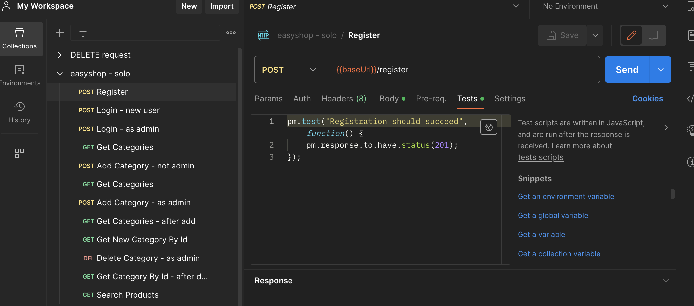
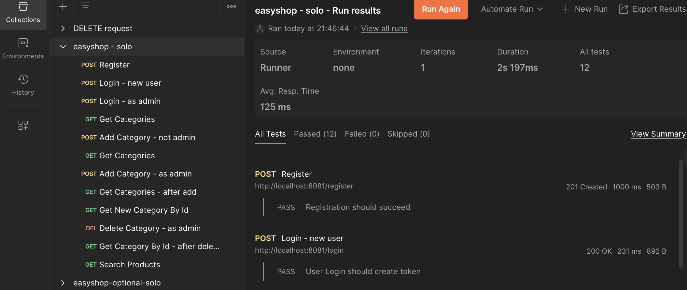
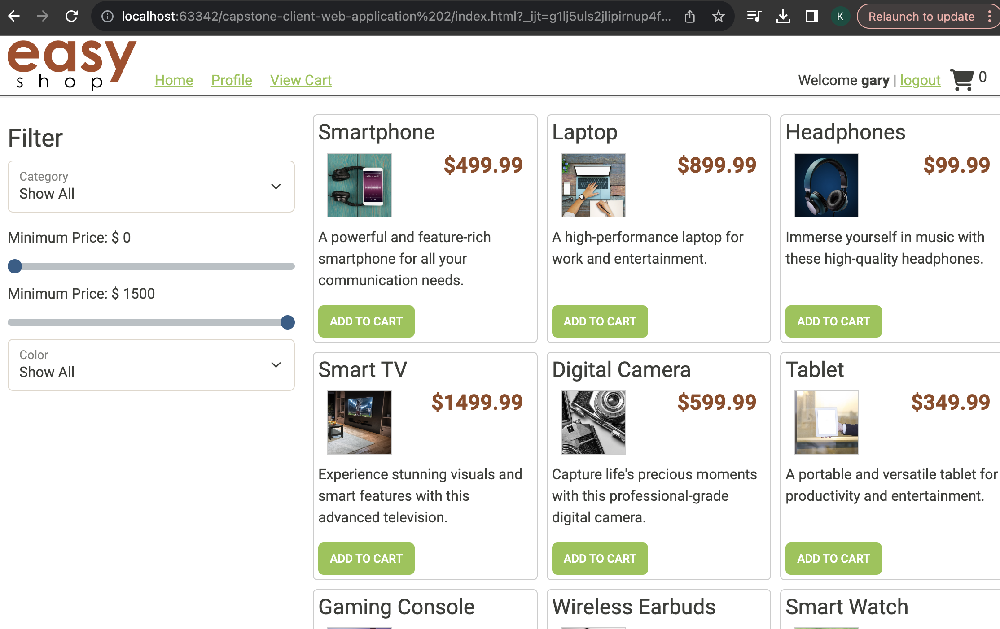

# EASYSHOP 
Easyshop is an immersive website where users can browse items and even add to cart and search.

## Project Overview
Backend of this website allows users to browse products in various categories, add them to a shopping cart and check out to order the products. All of the features of the Ul are fully functional. The changes and development will only need to be done in the backend Spring Boot Java API project.
The existing API code includes:
• user registration and login
• the ability to display products by category
• search for or filter the products list.

## Build and Runtime Requirements
+ JDK 17 or later
+ IntelliJ IDEA 

## Common setup
Clone the repo and install the dependencies.

## Features

## Testing with Postman
- [Postman](https://www.postman.com/) installed on your machine.
1. **Open Postman:**
2. **Import the Postman Collection:**
3. **Set Environment Variables:**
4. **Run Requests:**

## Other Technology Stack
#### Workbench
The database folder contains a database script (create_database. sql). Open this script in MySql Workbench and execute it.
| category_id   | name          | description  |
| ------------- |:-------------:| -----:       |
| 3             | home & kitchen| find...      |
| 2             | fashion       | discover...  |
| 1             | electronics   | Explore...   |

#### Terminal
git bash

## Screenshots

## Project Status
Active
